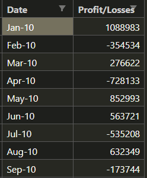
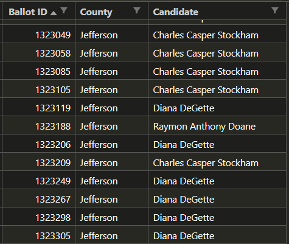

# Saving Data Analyses to CSVs with Python

This project demonstrates data summarization using Python for two different datasets with financial data and poll data respectively. The results are presented in the terminal and written to a CSV file.

## Imported Python Libraries
* os
* csv

## Poll Data (PyBank)
### Data
This dataset representing financial records for a company contains two columns in a file called [budget_data.csv](PyBank/Resources/budget_data.csv):
* Date
* Profit/Losses

#### Excerpt

### Analysis
The following calculations are conducted:
* The total number of months included in the dataset
* The net total amount of "Profit/Losses" over the entire period
* The changes in "Profit/Losses" over the entire period, and then the average of those changes
* The greatest increase in profits (date and amount) over the entire period
* The greatest decrease in profits (date and amount) over the entire period

### Approach
#### Data Preparation
* The data are read in using the csv and os libraries.
* The header is stored and excepted from calculations using the next function.
* The budget data is stored to a list for ease of iteration.

#### Calculations
* Total Months: The number of total months is determined by using the len function to find the length of the list storing the budget data (minus the header row), since data for each month-year combination only appears once.
* Total Amount of Profit/Losses: Starting with a 0 value for a variable called balance, a for loop iterates through each row in the list of budget data and adds the profit/loss value to the balance. The final balance is determined at the end of this for loop.
* Average Change: To calculate the average change in profit/losses from month-to-month over the entire period, first the change between the current and previous profit/loss value is calculated as a for loop iterates over the data. The values for change are appended to a list. Once the for loop has concluded, the average change is computed by dividing the sum of the values in the list by the length of the list, and then rounded to 2 decimal places.
* Greatest Increase/Decrease in Profits: As the for loop iterates through the budget data, the value for change between current and previous profit/loss values is compared to the stored value for max_increase and max_decrease, which both start at 0. If the calculated change is greater than or less than the max_increase and max_decrease respectively, the change value is stored as the new max value. The month is also recorded. The final values are available once the loop has concluded.

#### Printing
* Printing to the terminal and to the csv file is handled by two separate functions.
* The first function, create_csv(), appends new lines to a csv file in the analysis folder under the name [budget_analysis.csv](PyBank/analysis/budget_analysis.csv).
* The second function, print_all(), prints data, text, and formatting generated in the script to the terminal using the print function and the csv file by calling the create_csv() function. Formatted statements with data is passed to this function in a list as values are calculated.

## Poll Data (PyPoll)
### Data
This dataset representing poll data from a small, rural town contains three columns in a file called [election_data.csv](PyPoll/Resources/election_data.csv):
* BallotID
* County
* Candidate

#### Excerpt

### Analysis
The following calculations are conducted:
* The total number of votes cast
* A complete list of candidates who received votes
* The percentage of votes each candidate won
* The total number of votes each candidate won
* The winner of the election based on popular vote.

### Approach
#### Data Preparation
* The data are read in using the csv and os libraries.
* The header is stored and excepted from calculations using the next function.
* The poll data is stored to a list for ease of iteration.
#### Calculations
* Total Votes: The number of total votes is determined by using the len function to find the length of the list storing the poll data (minus the header row).
* Unique Candidates: A set is created to store the unique list of candidates. A for loop iterates through the list containing the poll data to compare the candidate's name to any stored in the set. If the name is missing, it is added to the set.
* Vote Counts per Candidate: Once the set of unique candidates is complete, another for loop iterates through each candidate. A nested for loop matches names in the poll data and increments the vote count accordingly.
* Winner: After the nested loop completes, if the count for the candidate is greater than the stored value of maximum votes for a candidate (initially set to 0), then the candidate and their number of votes is stored as the potential winner. The ultimate winner is decided after all for loops have completed their runs.
* Vote Percentage: Once the votes have been tallied for the candidate, the vote percentage is calculated by dividing the vote count by the total number of votes, multiplied by 0 and rounded to 3 decimal points.
#### Printing
* Printing to the terminal and to the csv file is handled by two separate functions.
* The first function, create_csv(), appends new lines to a csv file in the analysis folder under the name [poll_results.csv](PyPoll/analysis/poll_results.csv).
* The second function, print_all(), prints data, text, and formatting generated in the script to the terminal using the print function and the csv file by calling the create_csv() function. Formatted statements with data is passed to this function in a list as values are calculated.

